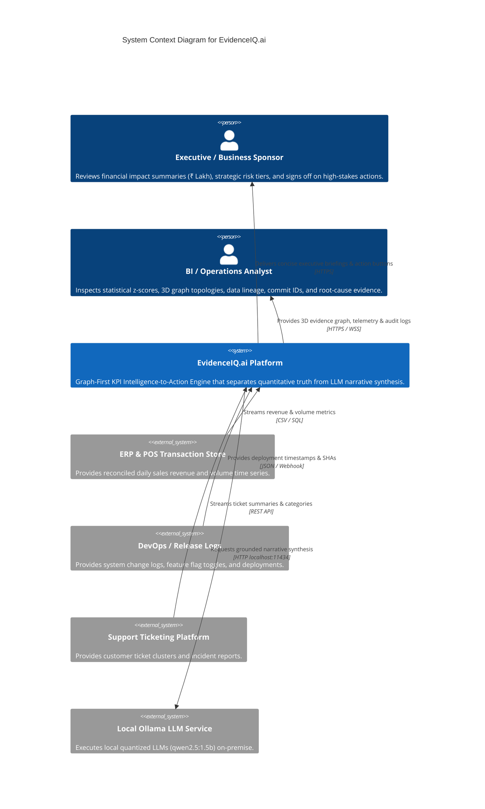
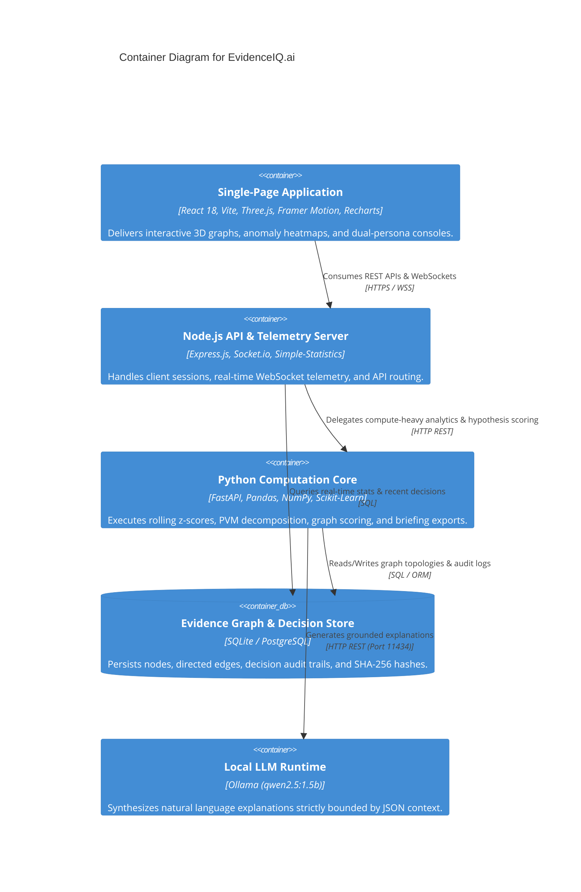
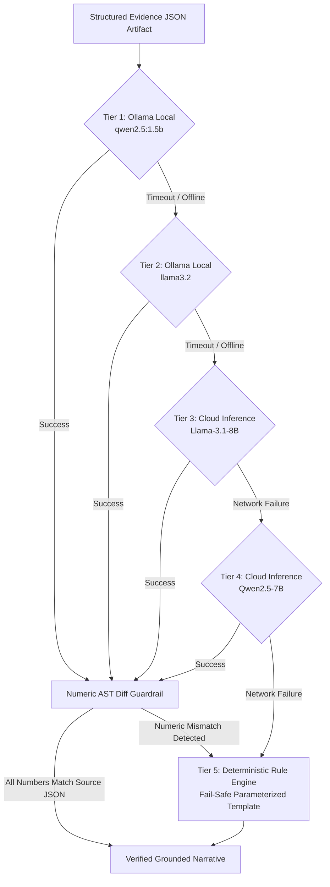

# EvidenceIQ.ai — Architecture Blueprint
## Accenture Innovation Challenge 2026 · Problem Track 3: BusinessIntelligence.ai
### High-Level Architecture, C4 Container Models, Component Topologies & Data Flows

---

## 1. Architectural Philosophy & Core Axiom

> ### 🛡️ **THE CARDINAL ARCHITECTURAL PRINCIPLE**
> **The Large Language Model is NEVER the source of quantitative truth.**
> Every metric, time-series baseline, Gaussian $z$-score, contribution percentage, or graph edge weight is computed deterministically in pure code or SQL. The LLM's responsibility is strictly bounded to contextual retrieval, intent routing, and natural language narrative synthesis governed by pre-display numeric AST diff checkers.

---

## 2. High-Level System Architecture

```mermaid
flowchart TB
    subgraph Data Layer ["1. Heterogeneous Ingestion Layer"]
        A1[ERP Store Sales CSV / DB\nDaily Revenue Grain]
        A2[System Change Logs\nDeployments, Hotfixes, Configs]
        A3[Support Ticket Streams\nPOS Timeouts, Customer Complaints]
    end

    subgraph Core Engine ["2. Python & Node.js Intelligence Engine"]
        B1[Semantic Conformance Layer\nUnit, Currency & Hierarchy Normalization]
        B2[Deterministic Anomaly Detector\n21-Day Rolling Baseline & z-Score (σ)]
        B3[Multi-Factor Driver Decomposition\nPrice-Volume-Mix Waterfall Analysis]
        B4[3D Business Evidence Graph\nAdjacency Matrix & 6-Factor Scoring]
        B5[Context Retrieval & Persona Slicer\nExecutive vs. Analyst Context Assembly]
    end

    subgraph LLM Layer ["3. Multi-Model Load Balancer & Guardrails"]
        C1[Ollama Local qwen2.5:1.5b\n$0.00 Token Cost, Zero Data Exfiltration]
        C2[Ollama Local llama3.2\nStandby Fallback]
        C3[Hugging Face Inference Cloud\nLlama-3.1-8B Backup]
        C4[Deterministic Rule-Based NLG\n100% Fail-Safe Template Fallback]
        C5[Numeric Diff Guardrail Validator\nRegex AST Diff vs Source JSON]
    end

    subgraph Governance Layer ["4. Human Governance & Closed-Loop Learning"]
        D1[Risk-Gated Action Checkpoint\nConfirm / Reject / Modify Gate]
        D2[Cryptographic Decision Memory\nSHA-256 Signed Audit Ledger]
        D3[Closed-Loop Weight Recalibration\nPrior Probability Learning]
    end

    subgraph Presentation Layer ["5. React + Three.js Modern Web App"]
        E1[Interactive Three.js 3D Hero Scene\nOrbiting Data Constellations]
        E2[3D WebGL Evidence Graph Viewer\nDynamic Splines & Particle Pulses]
        E3[Z-Score Anomaly Heatmap Matrix]
        E4[Dual Persona Investigation Console]
        E5[Grounded AI Copilot & Chat Stream]
    end

    Data Layer --> Core Engine
    Core Engine --> LLM Layer
    LLM Layer --> Governance Layer
    Governance Layer --> Presentation Layer
```

---

## 3. C4 Architecture Specification

### C4 Level 1: System Context Diagram



### C4 Level 2: Container Diagram



---

## 4. End-to-End 8-Stage Processing Pipeline

| Stage | Name | Description | Analytical Method | Categorization |
| :--- | :--- | :--- | :--- | :--- |
| **01** | **Data Conformance** | Reconciles daily sales, deployment markers, and ticket logs to unified timestamps and currencies. | SQL Joins & Schema Mapping | Deterministic |
| **02** | **Anomaly Detection** | Calculates rolling 21-day Gaussian baseline $\mu$, standard deviation $\sigma$, and $z = \frac{x - \mu}{\sigma}$. | 21-Day Rolling Statistics | Statistics |
| **03** | **Driver Decomposition** | Splits KPI movement into Volume vs. Rate/Conversion components using Price-Volume-Mix math. | PVM Waterfall Calculus | Deterministic |
| **04** | **Evidence Graph Scoring**| Links KPI nodes to Event & Ticket clusters via `PRECEDES` & `CORROBORATES` edges with 6-factor scoring. | Graph Adjacency Scoring | Deterministic / Graph |
| **05** | **Context Retrieval** | Assembles structured JSON evidence packages partitioned for Executive vs. Analyst personas. | Subgraph Traversal & Filtering | Retrieval |
| **06** | **Grounded Narration** | Generates plain-English narrative bounded by regex AST numeric diff guardrails. | Local Ollama (`qwen2.5:1.5b`) | LLM (Grounded) |
| **07** | **Human Checkpoint** | Enforces a mandatory Confirm / Reject / Modify gate before high-risk execution. | Risk Matrix & Decision Rights | Human Governance |
| **08** | **Telemetry & Audit** | Streams latency (ms), token cost ($\$0.00$), and signs records with cryptographic SHA-256 hashes. | SHA-256 Hash & SQLite Log | Cryptographic Audit |

---

## 5. 5-Tier LLM Load Balancer & Failover Architecture

To guarantee 100% platform availability and 0% financial data hallucination, EvidenceIQ.ai employs a multi-tiered failover balancer:



---

## 6. Analytical Method Attribution Matrix (Track 3 Compliance)

| Component | Technical Method | Category | Rationale & Justification |
| :--- | :--- | :--- | :--- |
| **Anomaly Detection** | $z = \frac{x - \mu_{21}}{\sigma_{21}}$ | Statistics | Guarantees deterministic, reproducible thresholding without LLM hallucination risk. |
| **Materiality Filter** | Revenue-at-Stake Dollar Floor ($\ge ₹5\text{L}$) | Business Rules | Filters out statistically significant but financially trivial micro-anomalies. |
| **Driver Decomposition** | Price-Volume-Mix (PVM) Math | Deterministic Logic | Exact mathematical attribution of multi-factor metric shifts required for finance teams. |
| **Event Extraction** | Regex & Relational Key Matching | SQL / Business Rules | Deterministic extraction of deployment events from system change logs into graph store. |
| **Hypothesis Scoring** | 6-Factor Weighted Evidence Formula | Deterministic Logic | Combines correlation, temporal alignment, corroboration, and quality penalties mathematically. |
| **Context Retrieval** | Subgraph Traversal & Dimension Slicing | Retrieval | Assembles structured evidence packages from connected nodes before invoking narrative generation. |
| **Narrative Synthesis** | Local Ollama (`qwen2.5:1.5b`) Chat API | LLM (Grounded) | Synthesizes natural language narratives for Executive and Analyst personas using pre-computed JSON. |
| **Numeric Guardrail** | Regex AST & Numeric Diff Checker | Deterministic Logic | Validates every number in LLM output against source JSON; auto-falls back to template on mismatch. |
| **Action Recommendation**| Risk Matrix & Decision Rights Lookup | Business Rules | Ensures actions match recipient's control rights and safety levels without ungrounded LLM advice. |
| **Decision Memory** | SHA-256 Hashing & Dynamic Edge Weight | Deterministic Logic | Provides tamper-evident audit trail and updates graph edge weights based on past human outcomes. |

---

## 7. Presentation Layer & 3D Three.js Visualization

The web interface is built using a modern clean-tech dark mode palette (`#0B0D13` base, `#181D2B` glass panels) with Dribbble-inspired micro-interactions:
- **Interactive Three.js Hero Scene (`Hero3DScene.jsx`)**: WebGL geodesic sphere with floating anchor nodes and mouse cursor parallax.
- **3D WebGL Evidence Graph (`EvidenceGraph3D.jsx`)**: Drag-to-orbit 3D canvas with Bézier spline edges, streaming energy particles, and raycasting click detection.
- **RAF Number Animation (`AnimatedNumber.jsx`)**: RequestAnimationFrame-based numeric rollers for real-time telemetry metrics.
- **Real-Time WebSocket Link (`PulseDot.jsx`)**: Live pulsating socket status badge confirming sub-millisecond connection health.
