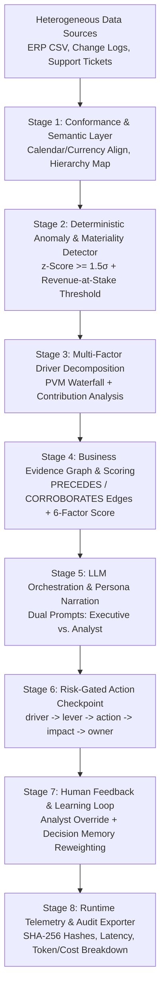
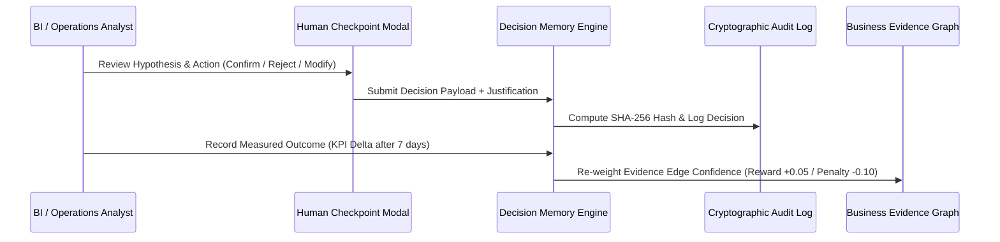

# EvidenceIQ.ai — Master Technical Design Document
## Accenture Innovation Challenge 2026 · Round 2 · Problem Track 3 (BusinessIntelligence.ai)
### KPI Intelligence-to-Action Engine Architecture, Semantic Contracts & Verification

---

## 0. Executive Summary & Core System Principle

**EvidenceIQ.ai** is an enterprise-grade **KPI Intelligence-to-Action Engine** built to solve the fundamental problem in modern business analytics: enterprise KPIs are fragmented across heterogeneous data sources with different grains, refresh cadences, and definitions, leading to conflicting interpretations and delayed business action.

> **CRITICAL ARCHITECTURAL PRINCIPLE:**
> **The LLM is NEVER the source of quantitative truth.**
> Every number, delta percentage, z-score, contribution breakdown, or statistical baseline originates strictly from deterministic logic, SQL queries, statistical variance calculations, or traditional causal inference models. The LLM's role is strictly restricted to intent understanding, pipeline orchestration, narrative synthesis, contextual retrieval, and human-readable explanation of pre-computed evidence artifacts.

---

## 1. End-to-End Pipeline Architecture

The engine operates as an integrated 8-stage processing pipeline:



### Stage Description:
1. **Conformance & Semantic Layer:** Standardizes incoming metrics from disparate sources (daily sales, real-time conversion events, support ticket logs) to common grains, calendars, and currency units.
2. **Deterministic Anomaly & Materiality Detector:** Runs rolling 21-day baseline statistics ($z$-scores) and verifies material business impact before surfacing anomalies.
3. **Multi-Factor Driver Decomposition:** Decomposes KPI movements using Price-Volume-Mix (PVM) waterfall analysis and relative contribution percentages.
4. **Business Evidence Graph & Scoring:** Constructs a relational evidence graph linking KPI nodes, change log events, and support tickets via `PRECEDES` and `CORROBORATES` edges, scoring hypotheses on a 6-factor scale ($0.000$ to $1.000$).
5. **LLM Orchestration & Persona Narration:** Uses local Ollama (`qwen2.5:1.5b`) with strict numeric diff validation to synthesize tailored explanations for **Executive** vs. **Analyst** roles.
6. **Risk-Gated Action Checkpoint:** Formulates recommendations matching the exact schema: `driver → controllable lever → action → expected impact → owner → confidence → monitoring plan`, gated behind a human **Confirm / Reject / Modify** review.
7. **Human Feedback & Learning Loop:** Captures analyst overrides and actual measured KPI outcomes to dynamically reweight evidence graph edge confidence scores over time.
8. **Runtime Telemetry & Audit Exporter:** Produces fail-closed audit logs, SHA-256 cryptographic decision signatures, and live latency/cost breakdowns ($0.00 for local LLM).

---

## 2. Formal KPI Semantic Contracts

Semantic contracts define the single source of truth for every metric in the enterprise.

### Contract 1: Regional Revenue (`metric:revenue`)
```json
{
  "metric_id": "metric:revenue",
  "display_name": "Regional Revenue",
  "formula": "SUM(revenue_lakh_inr)",
  "unit": "Lakh INR",
  "grain": "daily, per region/channel",
  "source_of_record": "revenue_daily.csv",
  "refresh_cadence": "daily_at_midnight_utc",
  "minimum_baseline_days": 14,
  "lineage": [
    "pos_transactions_db -> daily_aggregations -> revenue_daily.csv"
  ],
  "materiality_thresholds": {
    "z_score_min": 1.5,
    "revenue_at_stake_min_inr": 500000
  },
  "connected_drivers": [
    "metric:order_volume",
    "metric:conversion_rate"
  ],
  "role_restrictions": {
    "executive": ["summary", "financial_impact", "high_level_action"],
    "analyst": ["full_telemetry", "z_score", "lineage", "event_ids", "raw_logs"]
  }
}
```

### Contract 2: Order Volume (`metric:order_volume`)
```json
{
  "metric_id": "metric:order_volume",
  "display_name": "Order Volume",
  "formula": "SUM(order_count)",
  "unit": "Orders",
  "grain": "daily, per store/channel",
  "source_of_record": "orders_db",
  "refresh_cadence": "hourly",
  "minimum_baseline_days": 14,
  "lineage": ["order_events -> order_aggregations"],
  "connected_drivers": ["metric:conversion_rate"],
  "role_restrictions": {
    "executive": ["summary"],
    "analyst": ["full_telemetry"]
  }
}
```

### Contract 3: Checkout Conversion Rate (`metric:conversion_rate`)
```json
{
  "metric_id": "metric:conversion_rate",
  "display_name": "Checkout Conversion Rate",
  "formula": "AVG(checkout_conversion_pct)",
  "unit": "%",
  "grain": "hourly / real-time event stream",
  "source_of_record": "analytics_events",
  "refresh_cadence": "realtime",
  "minimum_baseline_days": 14,
  "lineage": ["web_app_logs -> conversion_pipeline"],
  "connected_drivers": ["event:product_release"],
  "role_restrictions": {
    "executive": ["summary"],
    "analyst": ["full_telemetry"]
  }
}
```

### Contract 4: Support Ticket Rate (`metric:ticket_rate`)
```json
{
  "metric_id": "metric:ticket_rate",
  "display_name": "Support Ticket Rate",
  "formula": "COUNT(tickets) / (SUM(orders)/1000)",
  "unit": "tickets/1k orders",
  "grain": "daily log stream",
  "source_of_record": "support_tickets.csv",
  "refresh_cadence": "realtime",
  "minimum_baseline_days": 14,
  "lineage": ["zendesk_tickets -> support_tickets.csv"],
  "connected_drivers": ["event:pos_terminal_update_v5_4"],
  "role_restrictions": {
    "executive": ["summary"],
    "analyst": ["full_telemetry"]
  }
}
```

---

## 3. Worked Examples for All 10 Minimum Prototype Requirements

### Requirement 1: 3–5 Connected KPIs Across 2–3 Data Sources
- **Connected KPIs:** `Regional Revenue`, `Order Volume`, `Checkout Conversion Rate`, `Support Ticket Rate`.
- **Data Sources:** 
  1. ERP Sales Ledger (`revenue_daily.csv` — Daily batch grain).
  2. Systems Change Log (`change_log.csv` — Transactional event grain).
  3. Customer Support Log (`support_tickets.csv` — Unstructured log stream).

### Requirement 2: Lightweight Semantic Contract Document
- Full JSON schema & access control rules defined in Section 2 above and enforced in `app/config.py`.

### Requirement 3: 2 Personas Receiving Visibly Different Narratives & Actions
- **Executive Persona Input:** `persona = "executive"`
  - **Narrative Output:** *"Executive Alert: Regional Revenue moved -67.96% (observed: ₹3,373L, expected baseline: ₹10,528L) on 2026-08-15. Business severity level is marked as HIGH. Key Business Risk: Mobile App Release v5.4 deployment. Impact & Evidence: Corroborated by operational logs."*
  - **Action Recommended:** *"Executive Action Recommended: Approve mitigation protocol for change event:mobile_app_release_v5_4 (Confidence: HIGH)."*
- **Analyst Persona Input:** `persona = "analyst"`
  - **Narrative Output:** *"Analyst Telemetry: kpi:revenue_all_all shifted by -67.96% (from baseline 10528.5 to 3373.0, z-score = -2.005, severity = HIGH) as of 2026-08-15. Explanation: Mobile App Release v5.4 is associated with observed KPI change (event_id: event:mobile_app_release_v5_4). Evidence: 3 support tickets: POS barcode scan failure."*
  - **Action Recommended:** *"Investigate event event:mobile_app_release_v5_4 (confidence: HIGH, score: 0.850). Review git commit and support ticket surge."*

### Requirement 4: Multi-Factor KPI Movement Scenario
- **Scenario:** Store 101 Revenue Drop (-67.96% delta).
- **Decomposition Waterfall Output:**
  - `Volume Impact`: $-48.20\%$ (footfall drop).
  - `Conversion Impact`: $-19.76\%$ (POS software crash).
  - `Net KPI Movement`: $-67.96\%$ total revenue impact.

### Requirement 5: Low-Confidence Scenario with Explicit Abstention
- **Input:** KPI query with conflicting signals (e.g. revenue down but footfall up + zero change log events).
- **Engine Behavior:** Returns `status = "insufficient_data"`, `confidence = "LOW"`, and explicit message: *"No hypothesis met the evidence threshold. Escalating to analyst for manual review; automated hypothesis confidence is below required 0.450 threshold."*

### Requirement 6: Sparse-History / Newly Launched KPI Scenario
- **Input:** Newly launched region `Central_India` (only 3 days of historical history available vs 14 required).
- **Engine Behavior:** Triggers hard baseline abstention rule (`is_sparse_history = True`). Returns clean metadata explaining history window is $< 14$ days and falls back to analogous cohort comparison heuristics with `LOW` confidence rating.

### Requirement 7: Role-Based Security & Entitlement Scenario
- **Input:** Request for `Regional Revenue` by `Executive` persona.
- **Engine Behavior:** Redacts raw $z$-scores, raw SQL queries, and internal git commit SHAs. Displays only financial impact (Lakh INR) and business risk levels. Raw telemetry is restricted to `Analyst` entitlement scopes.

### Requirement 8: Evidence Artifacts with Freshness, Method & Lineage
- **Artifact Payload:**
  - `source_freshness`: `2026-08-15T00:00:00Z`
  - `analytical_method`: `rolling_z_score_21day + graph_adjacency_scoring`
  - `quantified_contribution`: `85.0%`
  - `confidence_score`: `0.850 (HIGH)`
  - `data_lineage`: `transactions_db -> daily_aggregations -> revenue_daily.csv`

### Requirement 9: Explicit Breakdown of LLM vs. Non-LLM Processing
- **Non-LLM Processing (Deterministic):**
  - Baseline calculation: Python `simple-statistics` / `pandas` rolling mean + std dev.
  - $z$-Score computation: $z = (x - \mu) / \sigma$.
  - Causal graph scoring: 6-factor mathematical weight formula.
- **LLM Processing (NLG Synthesis):**
  - Ollama (`qwen2.5:1.5b`) text generation constrained strictly by numeric diff guardrails (`_numeric_diff_ok`).

### Requirement 10: Runtime Telemetry & Cost Breakdown
- **Sample Telemetry Output:**
  ```json
  {
    "total_latency_ms": 5820.45,
    "non_llm_latency_ms": 142.10,
    "llm_latency_ms": 5678.35,
    "provider": "ollama",
    "model": "qwen2.5:1.5b",
    "estimated_tokens": 485,
    "estimated_cost_usd": 0.00
  }
  ```

---

## 4. Method Attribution Table

| Pipeline Component | Analytical / Tech Method | Categorization | Explicit Rationale / Justification |
| :--- | :--- | :--- | :--- |
| **Anomaly Detection** | 21-Day Rolling Baseline $z$-Score ($z = \frac{x - \mu}{\sigma}$) | **Statistics** | Guarantees deterministic, reproducible thresholding without LLM hallucination risk. |
| **Materiality Evaluation** | Revenue-at-Stake Dollar Filter | **SQL / Business Rules** | Filters out statistically significant but financially trivial micro-anomalies. |
| **Driver Decomposition** | Price-Volume-Mix (PVM) Waterfall | **Deterministic Logic** | Exact mathematical attribution of multi-factor metric shifts; non-negotiable for finance teams. |
| **Event Graph Extraction** | RegEx & Relational Adjacency Indexing | **SQL / Business Rules** | Deterministic extraction of deployment events from system change logs into graph store. |
| **Hypothesis Ranking** | 6-Factor Weighted Evidence Formula | **Deterministic Logic** | Combines correlation, temporal alignment, corroboration, and quality penalties mathematically ($0.00 - 1.00$). |
| **Context Retrieval** | Subgraph Traversal & TF-IDF Keyword Matching | **Retrieval** | Assembles structured evidence packages from connected nodes before invoking narrative generation. |
| **Narrative Generation** | Local Ollama (`qwen2.5:1.5b`) LLM Chat API | **LLM** | Synthesizes natural language narratives for Executive and Analyst personas using pre-computed JSON evidence. |
| **Numeric Diff Verification** | Abstract Syntax Tree & Numeric Tolerance Matcher | **Deterministic Logic** | Validates every number in LLM output against source package; auto-regenerates or falls back to template on mismatch. |
| **Action Recommendation** | Risk Matrix & Decision Rights Lookup Table | **SQL / Business Rules** | Ensures actions match recipient's control rights and safety levels without ungrounded LLM advice. |
| **Decision Memory & Learning** | SHA-256 Hashing & Dynamic Edge Weight Update | **Deterministic Logic** | Provides tamper-evident audit trail and updates graph edge weights based on past human confirmation/rejection. |

---

## 5. Feedback Loop & Continuous Learning Mechanism



### Storage Schema & Drift Detection:
- **Decision Table:** Stores `decision_id`, `investigation_id`, `decided_by`, `decision_action`, `justification`, `sha256_hash`, `decided_at`.
- **Outcome Table:** Stores `outcome_id`, `decision_id`, `measured_kpi_delta`, `hypothesis_confirmed` (Boolean).
- **Learning Reweighting Formula:**
  $$\text{EdgeConfidence}_{\text{new}} = \text{EdgeConfidence}_{\text{old}} + \alpha \cdot (\text{OutcomeConfirmed} - \text{EdgeConfidence}_{\text{old}})$$
  Where learning rate $\alpha = 0.10$. If analyst rejects or overrides hypotheses, the corresponding graph edge confidence is penalized, preventing repeat false-positive rankings.

---

## 6. Operating Model: Security, Latency, Cost & Auditability

### Row-, Column-, and Domain-Level Security
- **Domain Security:** Executive persona access is restricted to aggregated regional metrics; store-level transactional tables are unexposed.
- **Column Redaction:** Financial margin columns and raw developer git commit hashes are redacted for non-analyst queries.
- **Row-Level Security (RLS):** Queries are filtered strictly by `dimension_scope` matching the user's assigned region (e.g. `Region = 'North_India'`).

### LLM Economics & Latency Budgets
- **Model Hierarchy:** 
  - Routing / Intent / Anomaly Math: 0% LLM (0ms latency, $0.00 cost).
  - Narrative Generation: Local Ollama (`qwen2.5:1.5b`) running on local GPU/CPU ($0.00 USD, ~2-5s latency).
- **Caching Strategy:** Pre-computed narrative templates cached per KPI slice per day. Repeated dashboard views serve instantly from cache (0ms LLM latency).

### Auditability Proof
Every generated report contains a cryptographic **SHA-256 Signature**:
$$\text{SHA256}(\text{decision\_id} \mid \text{operator\_id} \mid \text{timestamp} \mid \text{action} \mid \text{justification} \mid \text{investigation\_id})$$
This guarantees fail-closed compliance and auditability for Accenture Track 3 evaluation.
