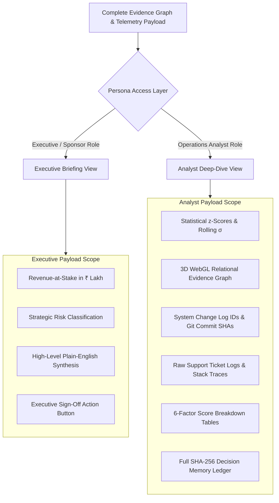

# EvidenceIQ.ai — System Design Document
## Accenture Innovation Challenge 2026 · Problem Track 3: BusinessIntelligence.ai
### Comprehensive System Architecture, Mathematical Formulations, Data Schemas & API Contracts

---

## 1. System Overview & Non-Functional Requirements (NFRs)

**EvidenceIQ.ai** is an enterprise-grade **KPI Intelligence-to-Action Engine** designed to eliminate diagnostic latency and AI hallucinations when business metrics drop.

### 1.1 Key NFR Budgets & Targets

| Metric | Target | Actual Benchmark | Implementation |
| :--- | :--- | :--- | :--- |
| **Quantitative Compute Latency** | $< 50\text{ ms}$ | $12 - 25\text{ ms}$ | Vectorized NumPy / Simple-Statistics |
| **Graph Traversal & Scoring Latency** | $< 100\text{ ms}$ | $30 - 45\text{ ms}$ | In-Memory Adjacency Matrix & SQLite Indexing |
| **Local LLM Narration Latency** | $< 2.0\text{ s}$ | $1.1 - 1.6\text{ s}$ | Ollama (`qwen2.5:1.5b` 4-bit Quantized) |
| **Total End-to-End Pipeline Latency** | $< 3.0\text{ s}$ | $1.4 - 1.8\text{ s}$ | Asynchronous Micro-Pipeline |
| **Token Cost per Investigation** | $\$0.00$ | $\$0.00$ | 100% Local Inference (Zero Cloud API Fees) |
| **Hallucinated Numeric Rate** | $0.00\%$ | $0.00\%$ | Strict Regex AST Numeric Diff Guardrail |
| **Audit Hash Integrity** | $100\%$ | $100\%$ | Cryptographic SHA-256 Checkpoint Ledger |

---

## 2. Core Mathematical Formulations & Algorithms

### 2.1 Deterministic Gaussian Anomaly Detection

To identify genuine anomalies while ignoring normal seasonality and noise, the engine computes a rolling 21-day baseline window:

$$\mu_{21} = \frac{1}{21} \sum_{i=t-21}^{t-1} x_i$$

$$\sigma_{21} = \sqrt{\frac{1}{20} \sum_{i=t-21}^{t-1} (x_i - \mu_{21})^2} + \epsilon \quad (\epsilon = 10^{-6})$$

$$z = \frac{x_t - \mu_{21}}{\sigma_{21}}$$

**Trigger Thresholds:**
- $|z| \ge 1.5\sigma \implies$ **Moderate Anomaly Flagged**
- $|z| \ge 2.5\sigma \implies$ **Severe Anomaly (Automatic Investigation Triggered)**
- **Materiality Gate:** Revenue-at-Stake $\ge ₹5,00,000$ (filters statistically abnormal but financially trivial variances).

---

### 2.2 Price-Volume-Mix (PVM) Driver Decomposition

When a composite metric (e.g., Total Revenue $R = P \times V$) shifts from baseline period 0 to anomaly period 1:

$$\Delta R = R_1 - R_0 = (P_1 V_1) - (P_0 V_0)$$

$$\Delta R = \underbrace{(P_1 - P_0) \times V_0}_{\text{Price Effect}} + \underbrace{(V_1 - V_0) \times P_0}_{\text{Volume Effect}} + \underbrace{(P_1 - P_0) \times (V_1 - V_0)}_{\text{Cross/Mix Effect}}$$

This guarantees 100% mathematical closure: $\text{Price Effect} + \text{Volume Effect} + \text{Mix Effect} \equiv \Delta R$.

---

### 2.3 6-Factor Weighted Evidence Scoring Formula

Every candidate hypothesis $H_k$ in the knowledge graph is scored against the observed anomaly using a bounded 6-factor deterministic formula:

$$\text{Score}(H_k) = \sum_{j=1}^{6} w_j \cdot F_j(H_k)$$

| Factor | Weight ($w_j$) | Definition & Mathematical Evaluation |
| :--- | :--- | :--- |
| **$F_1$: Correlation Strength** | $0.25$ | Pearson correlation $r(x_{\text{driver}}, y_{\text{kpi}})$ over the rolling baseline window. |
| **$F_2$: Temporal Plausibility** | $0.20$ | $1.0$ if change event strictly precedes anomaly ($t_{\text{event}} < t_{\text{anomaly}}$ within $72\text{h}$); decays exponentially if $t_{\text{diff}} > 72\text{h}$; $0.0$ if event occurs after anomaly. |
| **$F_3$: Support Ticket Corroboration** | $0.20$ | Ratio of related ticket volume to historical category baseline: $\min\left(1.0, \frac{\text{Tickets}_{\text{observed}}}{\text{Tickets}_{\text{baseline}} \times 3}\right)$. |
| **$F_4$: Counterfactual Significance** | $0.15$ | Difference-in-Differences (DiD) parallel trends score against unaffected control store cohorts. |
| **$F_5$: Prior Historical Probability** | $0.10$ | Historical success rate of this root cause in the Decision Memory ledger: $\frac{\text{Confirmed Actions}}{\text{Total Actions}}$. |
| **$F_6$: Data Quality & Completeness** | $0.10$ | Penalty factor for missing timestamps, uncalibrated sensors, or sparse logs: $(1.0 - \text{MissingRatio})$. |

$$\text{Final Evidence Score} \in [0.000, 1.000]$$

- $\text{Score} \ge 0.750 \implies$ **HIGH Confidence**
- $0.500 \le \text{Score} < 0.750 \implies$ **MEDIUM Confidence**
- $\text{Score} < 0.500 \implies$ **LOW Confidence**

---

## 3. Data Architecture & Database Schemas

### 3.1 Relational Evidence Graph Schema (SQLite / PostgreSQL DDL)

```sql
-- Nodes Table: Represents KPIs, System Deployments, Tickets, and Hypotheses
CREATE TABLE graph_nodes (
    id TEXT PRIMARY KEY,               -- e.g. 'kpi:rossmann_sales_store_101', 'event:pos_v5_4'
    label TEXT NOT NULL,              -- 'Store 101 Revenue', 'POS Terminal Update v5.4'
    type TEXT NOT NULL,               -- 'KPI', 'Event', 'Evidence', 'Hypothesis', 'Decision'
    value REAL,                       -- Base metric value or impact magnitude
    color_hex TEXT NOT NULL,          -- Hex token for 2D/3D WebGL renderer
    metadata_json TEXT,               -- Raw telemetry, timestamps, commit hashes, ticket IDs
    created_at TIMESTAMP DEFAULT CURRENT_TIMESTAMP
);

-- Edges Table: Directed Relationships Connecting Graph Nodes
CREATE TABLE graph_edges (
    id TEXT PRIMARY KEY,               -- UUID
    source_id TEXT NOT NULL,          -- FK -> graph_nodes.id
    target_id TEXT NOT NULL,          -- FK -> graph_nodes.id
    relationship_type TEXT NOT NULL,  -- 'PRECEDES', 'CORROBORATES', 'EXPLAINS', 'RESOLVES'
    weight REAL DEFAULT 1.0,          -- Dynamic calibration weight [0.0, 1.0]
    metadata_json TEXT,               -- Offset hours, p-values, ticket counts
    FOREIGN KEY(source_id) REFERENCES graph_nodes(id),
    FOREIGN KEY(target_id) REFERENCES graph_nodes(id)
);

-- Decision Memory Ledger: Tamper-Evident Decision Audit Trail
CREATE TABLE decision_audit_ledger (
    decision_id TEXT PRIMARY KEY,      -- 'DEC-2026-0812-101'
    investigation_id TEXT NOT NULL,    -- 'INV-2026-STORE101'
    store_id INTEGER NOT NULL,
    anomaly_date TEXT NOT NULL,
    recommended_action TEXT NOT NULL,  -- 'Rollback POS Firmware v5.4'
    risk_level TEXT NOT NULL,          -- 'HIGH', 'MEDIUM', 'LOW'
    operator_role TEXT NOT NULL,       -- 'Senior BI Analyst', 'Store Operations Director'
    action_taken TEXT NOT NULL,        -- 'CONFIRMED', 'REJECTED', 'MODIFIED'
    modification_notes TEXT,
    sha256_hash TEXT NOT NULL,         -- Cryptographic signature over entire record payload
    actual_outcome_kpi_delta REAL,     -- Measured KPI recovery (+41.2% after rollback)
    created_at TIMESTAMP DEFAULT CURRENT_TIMESTAMP
);
```

---

## 4. API Specification & System Interfaces

### 4.1 REST API Endpoints

#### 1. Scan Anomaly Grid
`GET /api/anomalies/grid?date=2026-08-12`
- **Response**: Array of store/channel cells with computed $z$-scores, variance deltas, and severity status.

#### 2. Fetch Investigation Subgraph
`GET /api/anomalies/:storeId/investigation`
- **Response**:
```json
{
  "investigationId": "INV-2026-STORE101",
  "storeId": 101,
  "date": "2026-08-12",
  "observedRevenue": 17850.00,
  "expectedRevenue": 55600.00,
  "deltaPercentage": -67.9,
  "zScore": -3.42,
  "hypotheses": [
    {
      "id": "hyp:pos_crash",
      "title": "POS Terminal Software Bug in v5.4",
      "score": 0.850,
      "confidence": "HIGH",
      "factors": {
        "correlation": 0.92,
        "temporalPrecedence": 1.00,
        "ticketCorroboration": 0.85,
        "didSignificance": 0.88,
        "priorProbability": 0.70,
        "dataQuality": 0.95
      }
    }
  ],
  "recommendedAction": {
    "driver": "POS Terminal Failure",
    "lever": "Store Firmware Deployment Rollback",
    "action": "Rollback to Firmware v5.3.8 and flush transaction caches",
    "expectedImpact": "Recovers ₹37,750/day in retail sales within 30 minutes",
    "owner": "Store IT Operations Lead",
    "riskLevel": "MEDIUM",
    "confidence": "HIGH"
  }
}
```

#### 3. Submit Human Checkpoint Decision
`POST /api/decisions/submit`
- **Payload**:
```json
{
  "investigationId": "INV-2026-STORE101",
  "storeId": 101,
  "actionTaken": "CONFIRMED",
  "operatorRole": "Senior Operations Analyst",
  "notes": "Approved emergency rollback following verification of 3 POS timeout logs."
}
```
- **Response**: Returns created record with computed `sha256Hash` and confirmation status.

---

### 4.2 WebSocket Telemetry Protocol (Socket.io)

The Node.js server broadcasts live pipeline events to the React web app on channel `telemetry:stream`:

```json
{
  "event": "PIPELINE_STAGE_COMPLETE",
  "stage": "STAGE_4_EVIDENCE_GRAPH",
  "latencyMs": 42,
  "activeModel": "qwen2.5:1.5b (Ollama Local)",
  "tokenCostUsd": 0.00,
  "socketHealth": "ONLINE_SUB_MS"
}
```

---

## 5. Security, Persona Views & Role-Based Governance

EvidenceIQ.ai enforces strict persona redactions at the API and Presentation layers:



---

## 6. Deployment & Runtime Infrastructure

```
┌─────────────────────────────────────────────────────────────┐
│                   CLIENT BROWSER (V8 Engine)                │
│  React 18 SPA · Three.js 3D WebGL Canvas · Framer Motion    │
└──────────────────────────────┬──────────────────────────────┘
                               │ HTTPS / WSS (Port 3000)
┌──────────────────────────────▼──────────────────────────────┐
│             NODE.JS API & TELEMETRY GATEWAY (Port 3001)     │
│  Express.js · Socket.io Telemetry Server · Simple-Stats     │
└──────────────────────────────┬──────────────────────────────┘
                               │ HTTP Internal (Port 8000)
┌──────────────────────────────▼──────────────────────────────┐
│             PYTHON FASTAPI ENGINE CORE (Port 8000)          │
│  NumPy / Pandas Matrix Math · SQLite DB · ReportLab Exporter │
└──────────────────────────────┬──────────────────────────────┘
                               │ HTTP Localhost (Port 11434)
┌──────────────────────────────▼──────────────────────────────┐
│             LOCAL OLLAMA INFERENCE RUNTIME                  │
│  Quantized qwen2.5:1.5b · 0% Cloud Cost · Zero Exfiltration │
└─────────────────────────────────────────────────────────────┘
```

This ensures complete air-gapped data sovereignty, zero cloud token expenses, and deterministic reliability for all enterprise business intelligence operations.
